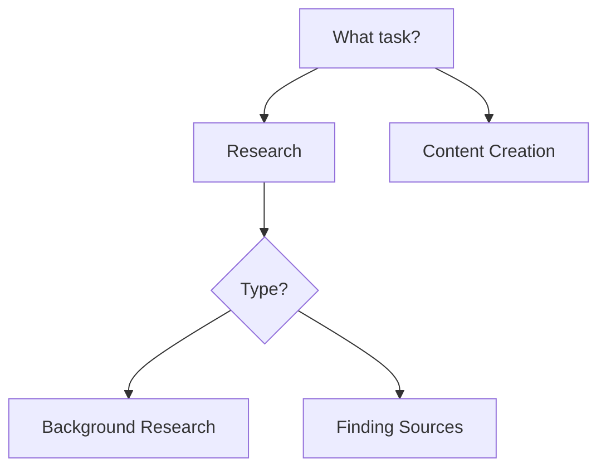

# Multi-Format Export Skill

This skill exports LLM Advisor decision tree data to multiple documentation formats in parallel, using Claude Code's forked context feature.

## When to Use

- Creating documentation for the resource kit
- Generating printable reference materials
- Preparing content for presentations
- Archiving decision tree structure

## Export Formats (Generated in Parallel)

### 1. Mermaid Flowchart

Convert `decision-tree.json` to Mermaid diagram syntax:



Output: `exports/decision-tree.mmd`

### 2. CSV Spreadsheet

Flatten decision tree to tabular format:

```csv
node_id,question,option_text,next_node,recommendation
start,"What task?",Research,research,
start,"What task?",Content Creation,content,
research,"Research type?",Background,background,"Use Claude 4.5 Opus"
```

Output: `exports/decision-tree.csv`

### 3. Markdown Table

Create navigable documentation:

```markdown
## Decision Tree Structure

### Start: What journalism task are you working on?

| Option | Leads To | Notes |
|--------|----------|-------|
| Research & background | research | Deep analysis tasks |
| Content creation | content | Writing and editing |
```

Output: `exports/decision-tree-docs.md`

### 4. JSON Schema

Generate JSON Schema for validation:

```json
{
  "$schema": "http://json-schema.org/draft-07/schema#",
  "type": "object",
  "required": ["start"],
  "properties": {
    "start": {
      "type": "object",
      "required": ["question", "options"]
    }
  }
}
```

Output: `exports/decision-tree.schema.json`

## Usage

```
/multi-format-export
```

Or specify formats:

```
/multi-format-export mermaid csv
```

## Output Location

All exports are placed in `resource-kit/docs/exports/` directory.

## Integration

The Mermaid output can be embedded in GitHub README files or rendered with tools like:
- GitHub Mermaid preview
- Mermaid Live Editor
- Obsidian notes
- Notion pages
